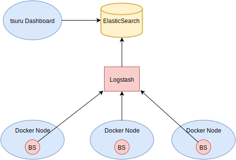

.. Copyright 2015 tsuru authors. All rights reserved.
   Use of this source code is governed by a BSD-style
   license that can be found in the LICENSE file.

Metrics
=======

Every docker node created on tsuru has a tsuru agent (a.k.a node-container),
called big-sibling, running as a container. One of it's responsibilities is
collecting and reporting metrics, such as cpu and memory usage, from both it's
host and other applications and containers running on the same host.

    Overview of all components involved on collecting, ingesting and displaying metrics.

Big-sibling will report metrics to a logstash component, which can be remote or local.
This logstash must be configured to output metrics to elasticsearch, where they will be stored
and where the tsuru dashboard fetches them to display graphics.

The following section will walkthrough the installation and configuration of these components.

Installing
----------

You will need a `Elasticsearch <https://www.elastic.co/guide/en/elasticsearch/reference/current/_installation.html>`_
and a `Logstash <https://www.elastic.co/guide/en/logstash/current/getting-started-with-logstash.html#installing-logstash>`_ installed.
Installing these components is beyond the scope of the documentation, please refer to their documentation for that.

After having both components installed, we can move on to configuring each one of them.

Configuring bs
++++++++++++++

We need to configure big-sibling, to send metrics to our logstash.

You should use `tsuru node-container-update big-sibling --env NAME=VALUE`
to define the config values.

The available configs are:

``METRICS_INTERVAL`` is the interval in seconds between metrics collecting and
reporting from bs to the metric backend. The default value is 60 seconds.

``METRICS_BACKEND`` is the metric backend. Only 'logstash' is supported right now.

Logstash specific configs:

``METRICS_LOGSTASH_CLIENT`` is the client name used to identify who is sending the
metric. The default value is tsuru.

``METRICS_LOGSTASH_PORT`` is the Logstash port. The default value is 1984.

``METRICS_LOGSTASH_HOST`` is the Logstash host. The default value is localhost.

Configuring Logstash
++++++++++++++++++++

tsuru sends data to Logstash using udp protocol and the message is formatted in
json. We need to define a custom logstash configuration to be able to parse the
metrics sent by big-sibling and send them to our elasticsearch cluster. The following
configuration does the job, refer to the `logstash documentation <https://www.elastic.co/guide/en/logstash/current/configuration.html>`_
for information regarding setting this configuration.

.. highlight:: ruby

::

    input {
        udp {
            port => 1984
        }
    }

    filter {
        json {
            source => "message"
        }

        if "_jsonparsefailure" in [tags] {
            mutate {
                add_field => {
                    client => "error"
                    metric => "metric_error"
                }
            }
        }
    }

    output {
        elasticsearch {
            hosts => ["http://ELASTICSEARCH_HOST:ELASTICSEARCH_PORT"]
            index => ".measure-%{client}-%{+YYYY.MM.dd}"
            document_type => "%{metric}"
            template => "/etc/logstash/template.json"
            template_name => "tsuru-template"
        }
    }

Where ``ELASTICSEARCH_HOST`` must point to your elasticsearch host and ``ELASTICSEARCH_PORT``
must point to your elasticsearch port. Refer to the `elasticsearch plugin configuration
<https://www.elastic.co/guide/en/logstash/current/plugins-outputs-elasticsearch.html#plugins-outputs-elasticsearch>`_
for more information. The file "/etc/logstash/tsuru-template.json" should have the following contents:

.. highlight:: ruby

::

    {
        "order": 0,
        "template": ".measure-*",
        "settings": {
            "index.refresh_interval": "5s"
        },
        "mappings": {
            "_default_": {
              "dynamic_templates": [
                {
                  "string_fields": {
                    "mapping": {
                      "omit_norms": true,
                      "type": "multi_field",
                      "fields": {
                        "raw": {
                          "index": "not_analyzed",
                          "ignore_above": 256,
                          "type": "string"
                        },
                        "{name}": {
                          "index": "analyzed",
                          "type": "string"
                        }
                      }
                    },
                    "match_mapping_type": "string",
                    "match": "*"
                  }
                }
              ],
              "properties": {
                "geoip": {
                  "dynamic": true,
                  "path": "full",
                  "properties": {
                    "location": {
                      "type": "geo_point"
                    }
                  },
                  "type": "object"
                },
                "@version": {
                  "index": "not_analyzed",
                  "type": "string"
                }
              },
              "_all": {
                "enabled": true
              }
            }
        },
        "aliases": {}
    }

Configuring Elasticsearch
+++++++++++++++++++++++++

tsuru requires an elasticsearch with groovy dynamic scripting enabled, since elasticsearch
v1.4.3, it's off by default and needs to be explicitly enabled on the config file.

For elasticsearch 2.x, scripting can be enabled by setting the following configuration:

.. highlight:: ruby

::

    script.engine.groovy.inline.aggs: true
    script.engine.groovy.inline.mapping: false
    script.engine.groovy.inline.search: false
    script.engine.groovy.inline.update: false
    script.engine.groovy.inline.plugin: false

For more information, check the `elasticsearch scripting docs
<https://www.elastic.co/guide/en/elasticsearch/reference/current/modules-scripting.html>`_

Configuring the Dashboard
+++++++++++++++++++++++++

**tsuru-dashboard** can be used to show a graphic for each metric by
application. This configuration can be set by using some environment
variables on the dashboard (if you are running the dashboard as a tsuru application,
those can be set by `tsuru env-set -a tsuru-dashboard`).

``ELASTICSEARCH_HOST`` this environment must point to your elasticsearch host.

``ELASTICSEARCH_INDEX`` this environment must be set to ".measure-$client", where $client
is the client name configured on big-sibling (defaults to tsuru).

It is also possible to display metrics about other containers (not only tsuru applications),
collected by big-sibling (including it's own metrics). To do so, tsuru dashboard
has an environment variable that controls what containers should have their metrics
displayed on the `Components` page.

``METRICS_COMPONENTS`` must contain a list of containers names that will have their
metrics displayed. For example: METRICS_COMPONENTS=big-sibling, will display big-sibling
container metrics.
