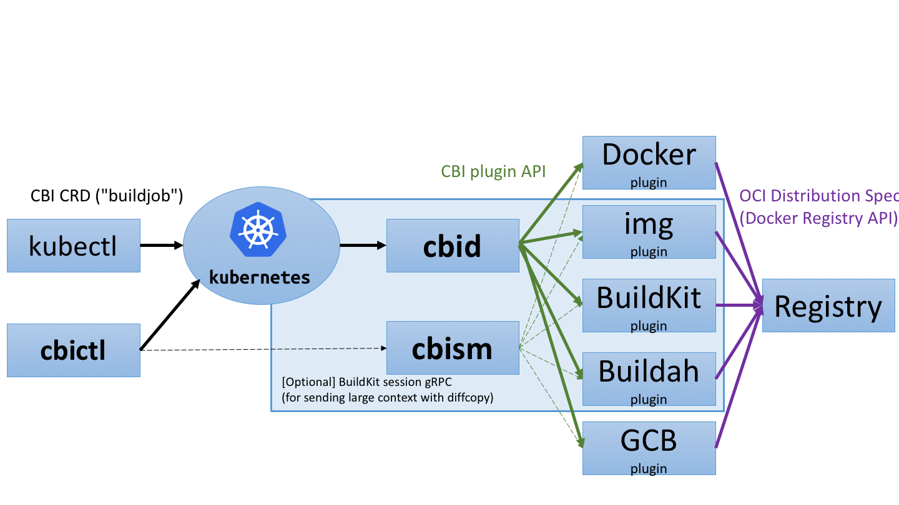

# CBI: Container Builder Interface for Kubernetes

CBI provides a vendor-neutral interface for building (and pushing) container images on top of a Kubernetes cluster,
with support for several backends such as [Docker](https://www.docker.com), [img](https://github.com/genuinetools/img), [BuildKit](https://github.com/moby/buildkit), and [Buildah](https://github.com/projectatomic/buildah).

## Current status

### Specification

* CBI CRD: pre-alpha, see [`pkg/apis/cbi/v1alpha1/types.go`](pkg/apis/cbi/v1alpha1/types.go).
* CBI plugin API: pre-alpha, see [`pkg/plugin/api/plugin.proto`](pkg/plugin/api/plugin.proto).

### Implementation

* CBI controller daemon (`cbid`): pre-alpha, see [`cmd/cbid`](cmd/cbid).

* Plugins (all of them are pre-alpha or even hasn't been started to work on):

Plugin | Support Dockerfile | Support `cloudbuild.yaml` | Support LLB
--- | --- | --- | ---
[Docker](https://www.docker.com) | Yes ✅| |
[BuildKit](https://github.com/moby/buildkit) | Yes ✅| Planned? (TBD) | Planned
[Buildah](https://github.com/projectatomic/buildah) | Yes ✅ | |
[kaniko](https://github.com/GoogleCloudPlatform/kaniko) | Yes ✅ | |
[img](https://github.com/genuinetools/img) | Yes ✅ | |

* Planned: [Google Cloud Container Builder](https://cloud.google.com/container-builder/), [OpenShift Image Builder](https://github.com/openshift/imagebuilder), [Orca](https://github.com/cyphar/orca-build), ...

<!-- TODO: figure out possibility for supporting Bazel, OpenShift S2I, Singularity... -->


* Context providers (available for all plugins)
    * ConfigMap
    * Git, with support for SSH secret
    * HTTP(S)
    * [Rclone](https://rclone.org): Amazon Drive, Amazon S3, Backblaze B2, Box, Ceph, DigitalOcean Spaces, Dreamhost, Dropbox, FTP, Google Cloud Storage, Google Drive, HTTP, Hubic, IBM COS S3, Memset Memstore, Microsoft Azure Blob Storage, Microsoft OneDrive, Minio, Nextloud, OVH, Openstack Swift, Oracle Cloud Storage, Ownloud, pCloud, put.io, QingStor, Rackspace Cloud Files, SFTP, Wasabi, WebDAV, Yandex Disk

* Planned context providers: [BuildKitSession](https://github.com/moby/buildkit/blob/b7424f41fdf60b178c5227abdd54cb615161123d/session/manager.go#L46)

Please feel free to open PRs to add other plugins.

## Quick start

Requires Kubernetes 1.9 or later.

### Installation

```console
$ kubectl apply -f https://raw.githubusercontent.com/containerbuilding/cbi/master/cbi-latest.yaml
```

The CBI controller daemon and the following plugins will be installed:

Plugin   | Note
---      | ---
Docker (highest priority)   | Docker needs to be installed on the hosts
Buildah  | Privileged containers needs to be enabled
BuildKit | Privileged containers needs to be enabled
kaniko   | N/A
img      | Privileged containers needs to be enabled (See [`kubernetes/community#1934`](https://github.com/kubernetes/community/pull/1934) and [Jess's blog](https://blog.jessfraz.com/post/building-container-images-securely-on-kubernetes/) for the ongoing work to remove this requirement)

You may edit the YAML file to remove unneeded plugins or change the priorities.

### Run your first `buildjob`

Create a buildjob `ex-git-nopush` from [`examples/ex-git-nopush.yaml`](examples/ex-git-nopush.yaml):
```console
$ kubectl create -f examples/ex-git-nopush.yaml
buildjob "ex-git-nopush" created
```

Make sure the buildjob is created:
```console
$ kubectl get buildjobs
NAME      AGE
ex-git-nopush       3s
```

Inspect the underlying job and the result:
```console
$ kubectl get job $(kubectl get buildjob ex-git-nopush --output=jsonpath={.status.job})
NAME      DESIRED   SUCCESSFUL   AGE
ex-git-nopush-job   1         1            30s
$ kubectl logs $(kubectl get pods --selector=job-name=ex-git-nopush-job --show-all --output=jsonpath={.items..metadata.name})
Sending build context to Docker daemon 79.87 kB
Step 1 : FROM alpine:latest
...
Successfully built bef4a548fb02
```

Delete the buildjob (and the underlying job)
```console
$ kubectl delete buildjobs ex-git-nopush
buildjob "ex-git-nopush" deleted
```

## Advanced usage

### Push to a registry

First you need to create a credential using `kubectl create secret docker-registry ...`.
See [Kubernetes's manual](https://kubernetes.io/docs/tasks/configure-pod-container/pull-image-private-registry/).

If you are using Amazon ECR, you may create the credential as follows (expires per 12 hours):

```console
$ TOKEN=`aws ecr get-authorization-token --output text --query authorizationData[].authorizationToken | base64 -d | cut -d: -f2`
$ kubectl create secret docker-registry my-registry-secret \
 --docker-server=https://12345678.dkr.ecr.ap-northeast-1.amazonaws.com \
 --docker-username=AWS \
 --docker-password="${TOKEN}" \
 --docker-email="${EMAIL}"
```

You can specify the registry credential via `spec.registry.secretRef.name`.

Example manifest:

```yaml
apiVersion: cbi.containerbuilding.github.io/v1alpha1
kind: BuildJob
metadata:
  name: ex-git-push
spec:
  registry:
    target: example.com/foo/bar:baz
    push: true
    secretRef:
      name: docker-registry-secret-name
  language:
    kind: Dockerfile
  context:
    kind: git
    git:
      url: ssh://me@git.example.com/foo/bar.git
```

### Build contexts

#### ConfigMap context

This is the easiest but only suitable for trivial images.

Example manifest:

```yaml
apiVersion: v1
kind: ConfigMap
metadata:
  name: ex-configmap-nopush-configmap
data:
  Dockerfile: |-
    FROM busybox
    ADD hello /
    RUN cat /hello
  hello: "hello, world"
---
apiVersion: cbi.containerbuilding.github.io/v1alpha1
kind: BuildJob
metadata:
  name: ex-configmap-nopush
spec:
  registry:
    target: example.com/foo/ex-configmap-nopush
    push: false
  language:
    kind: Dockerfile
  context:
    kind: ConfigMap
    configMapRef:
      name: ex-configmap-nopush-configmap
```

#### Git context

Git context is suitable for most cases.

If the repo is private, you need to create a SSH secret as follows, and specify the secret via `spec.context.git.sshSecretRef.name`:

```console
$ kubectl create secret generic ssh-secret-name --from-file=id_rsa=$HOME/.ssh/id_rsa --from-file=config=$HOME/.ssh/config --from-file=known_hosts=$HOME/.ssh/known_hosts
```

Example manifest:

```yaml
apiVersion: cbi.containerbuilding.github.io/v1alpha1
kind: BuildJob
metadata:
  name: ex-git-nopush
spec:
  registry:
    target: example.com/foo/bar:baz
    push: false
  language:
    kind: Dockerfile
  context:
    kind: git
    git:
# only url is mandatory. See git(1) for url spec.
      url: ssh://me@git.example.com/foo/bar.git
      revision: master
      sshSecretRef:
        name: ssh-secret-name
```

#### HTTP(S) context

HTTP(S) context provider allows using tar(.gz) archive as a build context.
This is useful for sending large contexts without interacting with a git repo.

You can create a temporary HTTP server in the Kubernetes cluster, and upload a context tarball as follows.
```console
$ kubectl run nginx --image nginx:alpine --port 80
$ kubectl expose deployment nginx
$ tar cvf a.tar /path/to/your-context-directory
$ kubectl cp a.tar $(kubectl get pod -l run=nginx -o jsonpath={..metadata.name}):/usr/share/nginx/html
```

Example manifest:

```yaml
apiVersion: cbi.containerbuilding.github.io/v1alpha1
kind: BuildJob
metadata:
  name: ex
spec:
  registry:
    target: example.com/foo/bar:baz
    push: false
  language:
    kind: Dockerfile
  context:
    kind: HTTP
    http:
      url: http://nginx/a.tar
```

#### Rclone context (S3, Dropbox, SFTP, and many)

[Rclone](https://rclone.org) supports fetching files and directories from various storage services: Amazon Drive, Amazon S3, Backblaze B2, Box, Ceph, DigitalOcean Spaces, Dreamhost, Dropbox, FTP, Google Cloud Storage, Google Drive, HTTP, Hubic, IBM COS S3, Memset Memstore, Microsoft Azure Blob Storage, Microsoft OneDrive, Minio, Nextloud, OVH, Openstack Swift, Oracle Cloud Storage, Ownloud, pCloud, put.io, QingStor, Rackspace Cloud Files, SFTP, Wasabi, WebDAV, Yandex Disk.

Any backend supported by Rclone should work with CBI, although only Amazon S3 is tested with CBI currently.

To use Rclone context provider, you need to create a secret from your `~/.config/rclone/rclone.conf`, and specify as `spec.context.rclone.secretRef`.

```console
$ kubectl create secret generic my-rclone-secret --from-file=$HOME/.config/rclone/rclone.conf
```

Example manifest:

```yaml
apiVersion: cbi.containerbuilding.github.io/v1alpha1
kind: BuildJob
metadata:
  name: ex-rclone-nopush
spec:
  registry:
    target: example.com/foo/ex-rclone-nopush
    push: false
  language:
    kind: Dockerfile
  context:
    kind: Rclone
    rclone:
      remote: s3
      path: my-s3-bucket/some-directory
      secretRef:
        name: my-rclone-secret
```

To use SFTP remote, you might need to specify `spec.context.rclone.sshSecretRef` as in Git context.

#### Plugin

### Specify the plugin explicitly

Usually. the plugin is automatically selected by the CBI controller daemon.

However, if you prefer a specific plugin for some reason such as performance or stability,
you can specify the plugin explicitly using `spec.pluginSelector` constraint.

e.g. for Buildah plugin (`plugin.name=buildah`),

```yaml
apiVersion: cbi.containerbuilding.github.io/v1alpha1
kind: BuildJob
metadata:
  ...
spec:
  pluginSelector: plugin.name=buildah
  ...
```


## Design (subject to change)

### Components

CBI is composed of the following specifications and implementations.

Specifications:

* CBI CRD: Kubernetes custom resource definition for `buildjob` objects.
* CBI plugin API: gRPC API used for connecting `cbid` to plugins.

Implementations:

* CBI controller daemon (`cbid`): a controller that watches creation of CBI CRD objects and creates [Kubernetes Job](https://kubernetes.io/docs/concepts/workloads/controllers/jobs-run-to-completion/#what-is-a-job) objects correspondingly.
* CBI CLI (`cbictl`): a reference CLI implementation for `cbid`
* CBI plugins: the actual pods that build and push images.
* CBI session manager (`cbism`): pods that speak [BuildKit session gRPC](https://github.com/moby/buildkit/blob/9f6d9a9e78f18b2ffc6bc4f211092722685cc853/session/filesync/filesync.proto) (or other similar protocols) for supporting large build context and diffcopy.

The concept of CBI session manager (`cbism`) is decoupled from `cbid`, so as to make `cbid` free from I/O overhead.



### Build context

CBI defines the following values for `context.kind`:

* `ConfigMap`: Kubernetes config map. Only suitable for small contexts.
* `Git`: git repository, with support for Kubernetes secrets 
* `HTTP`: HTTP(S) tar(.gz) ball
* `Rclone`: Rclone

Plugin implementations SHOULD implement `ConfigMap`, `Git`, and `HTTP`, but none of them is mandatory.
Also, implementations MAY accept non-standard `context.kind` values.

For ease of implementation of these context providers, CBI provides [`cbipluginhelper` image](./Dockerfile.cbipluginhelper) that contains CLI utilities for accessing these remote contexts.
Plugin implementations may inject the `cbipluginhelper` image with an `emptyDir` volume into the `initContainers` of the job pods, so as to support contexts that are not natively supported by the backends.

e.g. CBI plugin for Docker (`cbi-docker`) supports Rclone context using `cbipluginhelper`, while Docker itself does not support Rclone.

#### BuildkitSession (Planned)

If `BuildkitSession` is specified as `context.kind`, the pod ID of a CBI session manager, TCP port number, and the session ID would be set to the status fields of the `BuildJob` object.

The client is expected to send the context to the specified session manager pod using BuildKit session gRPC (via [the HTTP/1.1 gate](https://github.com/moby/buildkit/blob/b7424f41fdf60b178c5227abdd54cb615161123d/session/manager.go#L46)).
To connect to the pod, the client may use `kubectl port-forward` or `kubectl exec ... socat`.

Future version would also provide [Ingress](https://kubernetes.io/docs/concepts/services-networking/ingress/) for exposing the CBI session manager in more efficient ways.

## Contribute to CBI

* Vendoring is managed via [dep](https://github.com/golang/dep).
* To update CRD definition, please edit [`pkg/apis/cbi/v1alpha1/types.go`](pkg/apis/cbi/v1alpha1/types.go) and run `hack/codegen/update-codegen.sh`. Please do not edit autogenerated files manually.

### Testing

```console
$ ./hack/build/build-push-apply.sh your-registry.example.com:5000/cbi test20180501
```

This command performs:

* Build and push CBI images as `your-registry.example.com:5000/cbi/{cbid,cbi-docker,...}:test20180501`
* Generate `/tmp/cbi.generated.yaml` so that the manifest uses the images on `your-registry.example.com:5000/cbi/{cbid,cbi-docker,...}:test20180501`.
* Execute `kubectl apply -f /tmp/cbi.generated.yaml`.

### Local testing with DinD

You may use `hack/dind/up.sh` for setting up a local Kubernetes cluster and a local registry using Docker-in-Docker.

```console
$ ./hack/dind/up.sh
$ DOCKER_HOST=localhost:62375 ./hack/build/build-push-apply.sh cbi-registry:5000/cbi test20180501
$ ./hack/dind/down.sh
```
The Kubernetes cluster and the "bootstrap" Docker listening at `localhost:62375` can connect to `cbi-registry:5000` without auth.


## FAQs

### Q: Does CBI standardize the Dockerfile specification?

A: No, the Dockerfile specification has been maintained by Docker, Inc.

CBI itself is neutral to any image building instruction language (e.g. Dockerfile).

However, most backend implementations would accept Dockerfile.

### Q: Does CBI replace BuildKit?

A: No, CBI just provides an abstract interface for several backends such as BuildKit.

### Q: Is CBI a part of Kubernetes, a Kubernetes incubator, or a CNCF project?

A: Currently no, unlike CRI/CNI/CSI.

But it'd be good to donate CBI to such a vendor-neutral organization if CBI becomes popular.
